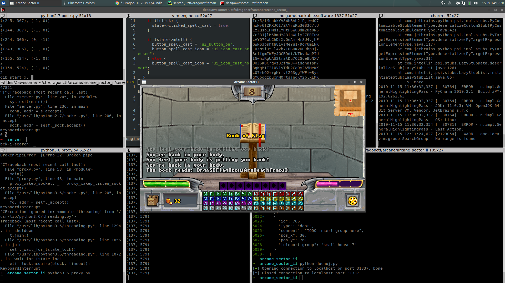

# Under the mountain (game, 50p, 13 solved)

In this quest we know that the flag is located in a very special place under a mountain.
It's impossible to get there, but if we look at spells we have available there is `spell_ghostly_visions` which allows us to clip through solid objects.
This spell lasts a few seconds, and then it moves us back to our body.

The issue is that we can't use objects while we're a ghost, so we can't read the flag.
Out intial idea was, to cast this spell second time, once we're next to the flag.
Then the first spell would finish and move us back to our body, and then the second spell would finish and move us back to the flag.

While we can't cast 2 spells at the same time, we can use the same trick as with amulets -> casting spell and using scroll are not exclusive.

We can use the scroll first, and then cast the spell directly when we're next to the flag.
Another option was to use teleport binding spell when you're next to the flag, but this is overly complicated for no reason.

Once we cast those two ghost spells we get:

