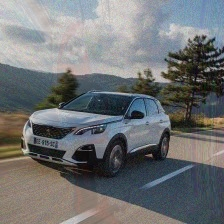

# Classifier9000

In this task we have access to a neural network image classifier which returns `(predictions, percentage_probabilities)` pair for each input image. We also have starting image "car.jpg" which is classified as `sports_car`. The task is to forge this image to be classified as `racer`.


The classifier has web interface and its source code in python is available. The analysis of source code (server.py) revealed two important observations:

- the input image is required to be the same size as "car.jpg" which is 224 x 224 px,
- the relative difference between the input image and "car.jpg" cannot exceed 2.

The first step was to obtain any image which is classified as `racer`. Eventually we found appropriate image and saved it as "racer.jpg"


The initial idea was to modify this image to exploit `diff(I, BASE_IMAGE) > 2` condition. It may be achieved when the output value of `diff` function is `nan`, for example with following transformation:

```
I = np.asarray(Image.open('racer.jpg'))
I2 = 1.1 * I - np.log(I)
```

and new image I2 was still classified as `racer` with 14.859884977340698 probability.

However we could not directly pass the image from the memory to web classifier. We first needed to save it as a file. Unfortunately, during this operation pixel values were rescaled to 0-255 range. This is why this approach was abandoned.


Another idea was to use both "car.jpg" and "racer.jpg" to create falsified image. The new image should be very similar to "car.jpg" but with some characteristics from "racer.jpg" to deceive the classifier. This was successful with the following code:

```
I3 = 0.8 * BASE_IMAGE + 0.1 * I**2
mpimg.imsave('car2.jpg', I3.astype('uint8'))
I3 = np.asarray(Image.open('car2.jpg'))
prediction.predictImage(I3, result_count=1, input_type="array")
```



The result of `diff(I3, BASE_IMAGE)` is 1.4934139792559178 which is less than 2. And the output of `prediction.predictImage(I3, result_count=1, input_type="array")` is `racer` with 40.07074534893036 probability.

Finally we have the flag! `ctfzone{f1r3-f1r3-pwn-7h3-cl4551f13r}`
