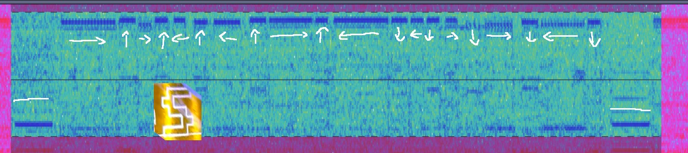
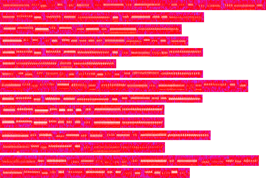

# The 3D Printer Task (misc, 252+12 pts, 12 solved)

Provided recording shows 3D printing session. Unfortunately the video was damaged after first letters, so the flag should be recovered from the audio.

Spectrogram analysis revealed some interesting patterns, best visible in 16000 Hz:

The vertical strips appear when the printer head is moving from one character to another. Between them there are narrow horizontal lines. It turned out that these lines correspond to outlines of the letters:

From total of 15 characters, the first 3 (`SAF`) occurred in the video. The fourth and the last one were assumed as `{` and `}` (and later confirmed). At that moment 10 characters remained unidentified.

For convenience the characters were laid one below another.

It is clearly visible that characters 5, 9 and 2 (known letter `A`) are identical in shape.

The remaining eight characters did not match known patterns, so they required another strategy. Key observations helpful to complete this task were:

- each character is only consisted of vertical and horizontal lines that are laid interchangeably,
- the printer head starts its movement in bottom left corner, draws lines counter-clockwise and returns to initial position, closing the loop.

In this way each character can be analyzed from the beginning or from the end. It is particularly useful for letters with flat left side, like D, E, F or P --- their spectrogram representation ends with very long line.

That approach allowed to deduce the flag: `SAF{AIRGAPPED2}`. The difficulty of the characters varied:

- trivial: I, A (shares the pattern with known letter)
- easy: E
- medium: P, D
- hard: R, G, 2

The whole task was quite burdensome, but the biggest problem was that `2` was initially identified as `Z` by the mistake. It took some time to find and correct this.
