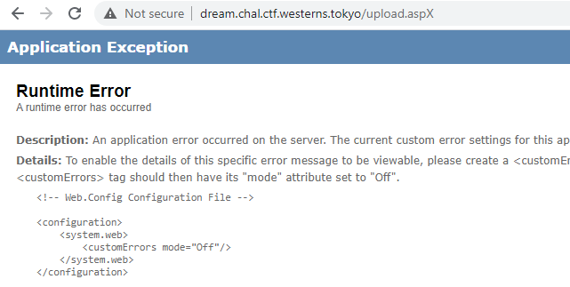

# Does Linux Dream of Windows?
Here we can see the ASP.NET application that allows to upload files, compress them with zip and browse all our uploaded / packed files.

We also have access to the source code and `apache2` directory content.

The flag is hidden in 3 parts inside source files: `upload.aspx`, `upload.aspx.cs` and `Web.config`

#### Observation 1
By looking at headers we can see that the application is running on linux:

`Server: Apache/2.4.41 (Ubuntu)`

and by examining config files we discover that the c# code is being run using mono framework.

#### Observation 2
Let's take a look at the hint given by organisers:
```
Hint2 (2020-09-19 20:00:00 UTC): Did you try "Back To Top" from upload.aspx? What's happening?
```

That link points to `http://dream.chal.ctf.westerns.tokyo/INDEX.HTM` - notice the capital letters. W can try different combinations of all the files available in web service and notice that all of the names are case-insensitive. There is no module responsible for that in apache config, so we can guess all the magic happens on filesystem level and we need to find some FS<->apache mismatch.

Trying to read source files with one letter changed to capital gives us an error:


Digging a little bit further we found that UTF character `ſ` is mapped to `s` in that FS. However, it is **not** `s`, so we can request the file `upload.aspx` as `upload.aſpx` and the code won't be executed and we'll be able to read the code. We can use the same trick for `upload.aspx.cs`. For `Web.config` we can use soft hypen character (https://en.wikipedia.org/wiki/Soft_hyphen) and request it as http://dream.chal.ctf.westerns.tokyo/Web.conf%C2%ADig

That gives us all 3 parts of the flag:
```
TWCTF{f29941def1f24f2c1e15ba36390e1302a61614bfc698267bc4a13485d6ae}
```