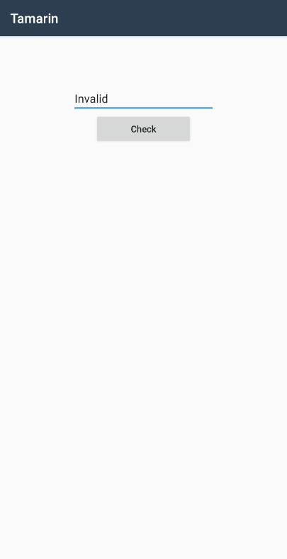

# Tamarin (re, 224p, 42 solved)

We're given an android apk that has a single text entry that acts as a flag check:



The apk turns out to be a Ahead-Of-Time compiled Xamarin application.
When searching for xamarin internals, we've came across a very [helpful SO thread](https://reverseengineering.stackexchange.com/questions/16508/unpacking-xamarin-mono-dll-from-libmonodroid-bundle-app-so) that presents a simple python script for extracting .NET dlls from `libmonodroid_bundle_app.so`.

This, surprisingly, give us a PE file that contains the flag checker method:

```c#
using System;
using Android.App;
using Android.Content.PM;
using Android.OS;
using Android.Runtime;
using Android.Support.V7.App;
using Android.Widget;
using Core;
using Xamarin.Essentials;
namespace Tamarin
{
    // Token: 0x02000002 RID: 2
    [Activity(Label = "@string/app_name", Theme = "@style/AppTheme", MainLauncher = true)]
    public class MainActivity : AppCompatActivity
    {
        // Token: 0x06000001 RID: 1 RVA: 0x00002050 File Offset: 0x00000250
        protected override void OnCreate(Bundle savedInstanceState)
        {
            base.OnCreate(savedInstanceState);
            Platform.Init(this, savedInstanceState);
            this.SetContentView(2131427356);
            EditText flagText = base.FindViewById<EditText>(2131230795);
            Button button = base.FindViewById<Button>(2131230763);
            string empty = string.Empty;
            button.Click += delegate(object sender, EventArgs e)
            {
                if (Check.Func4(flagText.Text))
                {
                    flagText.Text = "The flag is TWCTF{" + flagText.Text + "}";
                    return;
                }
                flagText.Text = "Invalid";
            };
        }
        // Token: 0x06000002 RID: 2 RVA: 0x000020B1 File Offset: 0x000002B1
        public override void OnRequestPermissionsResult(int requestCode, string[] permissions, [GeneratedEnum] Permission[] grantResults)
        {
            Platform.OnRequestPermissionsResult(requestCode, permissions, grantResults);
            base.OnRequestPermissionsResult(requestCode, permissions, grantResults);
        }
    }
}
```

`Check.Func4` being the core flag check function. Generally, it cuts the input text into chunks and converts them into uints.
Those numbers are then inserted into hardcoded polynomials. These polynomials are then applied to randomly-generated data a large amount of times and checked against other hardcoded values.

Since the input data is random and the application works correctly every time, the final polynomials must have a "stale point" that match the expected final values.

Using a bit of math-foo we're then able to find the required input values:
```python
for0 = polynominal([0] + coeffs, expected, len(coeffs))
fore = (expected - for0) % 2**32
print(for0)
print polynominal([fore] + coeffs, expected, len(coeffs))
print(expected)
```

And get the flag:
`Xm4r1n_15_4bl3_70_6en3r4t3_N471v3_C0d3_w17h_VS_3n73rpr153_bu7_17_c0n741n5_D07_N3t_B1n4ry`
