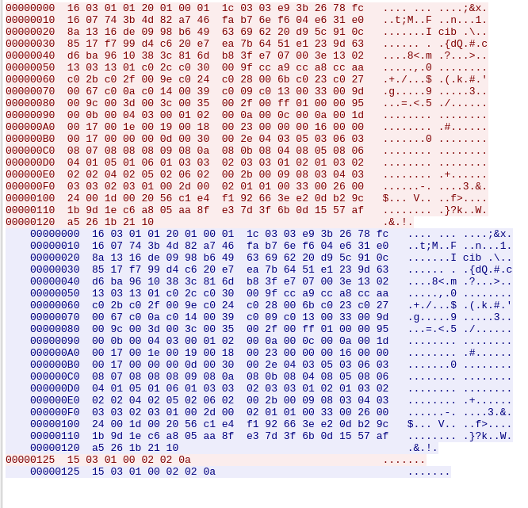

# babyshell [242 points] (38 solves)

Files:

 - task.tgz

## Part 0: research

We found ourselves with a qemu image, which after quick google, can be unpacked with a simple `lz4 initramfs.release.img.lz4 | cpio -i`. There we can inspect `/init`

```bash
#! /bin/sh
mount -t devtmpfs dev /dev
mount -t proc proc /proc
mount -t sysfs sysfs /sys

sysctl -w user.max_user_namespaces=0
ip link set up dev lo
adduser -D -s /bin/sh -u 1000 user

mount -o remount,ro /

/bin/server
setsid /bin/cttyhack login -f user

poweroff -d 1 -n -f
```

Interesting parts being `/bin/server`. `/bin/cttyhack` turned out to be regular [cttyhack](https://git.busybox.net/busybox/tree/shell/cttyhack.c). Also, entire file system is read-only `mount -o remount,ro /`

## Part 1: inspecting the binary

A quick glance in ghidra showed that binary starts SSL server and binds on `127.0.0.1:4433`:

```c
  init_openssl();
  ssl_ctx = create_context();
  configure_context(ssl_ctx);
  socket = create_socket();
  while( true ) {
    addr = 0x10;

    // stack string '\ntset'
    local_16 = 0x74736574;
    local_12 = 10;

    status = accept(socket, &sockaddr, &addr);
    if (status < 0)
        break;

    ssl_con = SSL_new(ssl_ctx);
    SSL_set_fd(ssl_con,status);
    status = SSL_accept(ssl_con);
    if (status < 1) {
      ERR_print_errors_fp(stderr);
    }
    else {
      handler(ssl_con);
    }
    SSL_shutdown(ssl_con);
    SSL_free(ssl_con);
    close(status);
  }
```

The handler functions looks something like this:

```c
  // this value is NOT seeded!
  int not_rand_val = rand();
  snprintf(buf,0x7f,"%d\n", not_rand_val);
  int buf_len = strlen(buf);
  SSL_write(ssl,buf, buf_len);
  SSL_read(ssl,buf,0x80);
  buf_to_int = atoi(buf);
  if (not_rand_val == buf_to_int) {
    char* flag = get_flag();
    int flag_len = strlen(flag);
    SSL_write(ssl, flag, flag_len);
  }
```

So, we just need to open SSL connection to the server and we get the flag? Should be easy...

## Part 2: The struggle

The linux inside image was an arch linux with busybox and almost no tools. That means openssl was not present. We couldn't drop a binary via shell, since entire file system was read only. There wasn't `nc` in path, but `/bin/busybox nc` did work! It's just a missing symlink. Here we had an idea - what if we use netcat as a proxy?

*note: I'm skipping here loooong hours spent on debugging*

The idea was to send:

`(while true; do base64 -d; done) | /bin/busybox nc 127.0.0.1 4433`

to the server, and using quick & dirty pwntools script open 2 sockets.

### problem #1



the server is echo'ing back what we send. This was solved by performing `stty -echo`.

### problem #2

Netcat would send our payload until stdin is closed. That's no good. We managed to bypass this with a `(while true; do read s; printf "$s"; done) | /bin/busybox nc 127.0.0.1 4433`

This did work, but we needed to change our encoding from base64 to `\\\\x41`.

### problem #3

Solution from #2 did work, but now we needed to fix some bytes (`\\x10` to `\\x16`). This was solved by adding <coed>| xxd -c1` at the end.

After a bit of debugging and hammering a **very** horrible pwntools script we got the flag:
`DrgnS{Shellcoding_and_shellscripting_whats_not_to_like}`. Turns out author had a completely different solution to the challenge. Well, unintended solution it is!

The final solving script can be found in `solve.py`.
