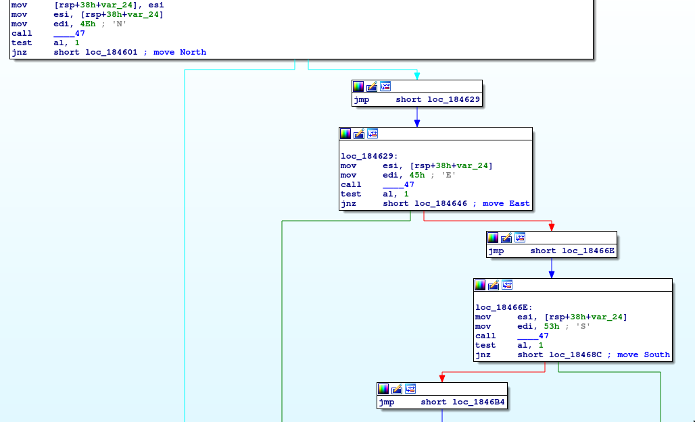

# Leavenworth Street [142 points] (24 solves)

> A twisty path beckons, will you find your way?

along with the challenge description we also got a docker image with deno and an executable:
```
chall/bin/leavenworth: ELF 64-bit LSB pie executable, x86-64, version 1 (SYSV), dynamically linked, interpreter /lib64/ld-linux-x86-64.so.2, BuildID[sha1]=01568d324806d2f9047260602156e4822c149aa5, for GNU/Linux 3.2.0, with debug_info, not stripped
```

running the executable showed us some interesting stuff, like the message `Started player process 9` and something that resembled a maze, along with the error `Module not found "file:///solver/solver.ts"`. we realized that the server expects a solver to be uploaded by us, but didn’t know what to do with the maze; thus, we decided to reverse-engineer the provided executable.

while reverse-engineering the binary we came across a subroutine with the name ”move”. we guessed it was a handler to process movement of the player on the board. this hypothesis proved correct once we took a closer look at the disassembly and confirmed that it processes four different ASCII chars that are commonly used for navigation - N/E/S/W.



having all that, we decided to write a simple maze solver that checks all tiles from the starting point until it finds a valid path to the ending point. next, the solver transforms that found path into the compass direction steps and outputs them as one line to standard output:

```typescript
const decoder = new TextDecoder();
let input
for await (const chunk of Deno.stdin.readable) {
    const text = decoder.decode(chunk)
    input = text.split('\n').slice(1).map(x => x.split(''))
    break
}

function breadthFirstSearch(start, end) {
    const history = new Map()
    const queue = []
    queue.push({ from: null, to: start })

    const check = ({ from, to }) => {
        if (to.y < 0 || to.y >= input.length) return false
        if (to.x < 0 || to.x >= input[0].length) return false

        let nextTile = input[to.y][to.x]
        if (nextTile === 'X') return false
        if (history.has(`x${to.x}y${to.y}`)) return false

        history.set(`x${to.x}y${to.y}`, from)
        if (to.x === end.x && to.y === end.y) {
            return true
        }

        queue.push({ from: to, to: { x: to.x + 1, y: to.y } })
        queue.push({ from: to, to: { x: to.x - 1, y: to.y } })
        queue.push({ from: to, to: { x: to.x, y: to.y + 1 } })
        queue.push({ from: to, to: { x: to.x, y: to.y - 1 } })
    }

    while (queue.length) {
        let step = queue.shift()
        if (check(step)) break
    }

    if (!history.has(`x${end.x}y${end.y}`)) return null

    const path = []
    let cur = end
    while (cur) {
        path.push(cur)
        cur = history.get(`x${cur.x}y${cur.y}`)
    }
    path.reverse()
    return path
}

const startY = input.findIndex(row => row.includes('S'))
const startX = input[startY].findIndex(tile => tile === 'S')

const endY = input.findIndex(row => row.includes('F'))
const endX = input[endY].findIndex(tile => tile === 'F')

let path = breadthFirstSearch({ x: startX, y: startY }, { x: endX, y: endY })

let steps = ''
for (let i = 0; i < path.length - 1; i++) {
    let from = path[i]
    let to = path[i+1]

    if (to.y < from.y) steps += 'N'
    else if (to.x > from.x) steps += 'E'
    else if (to.y > from.y) steps += 'S'
    else steps += 'W'
}
console.log(steps)
```
