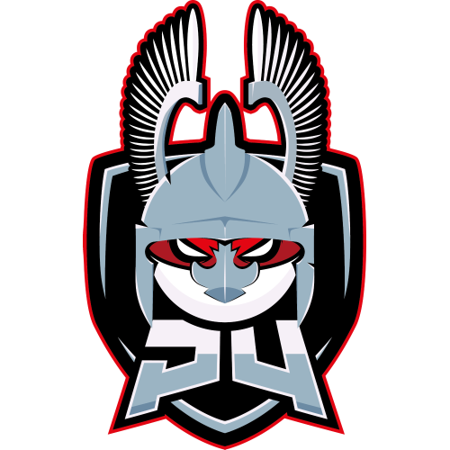

# CTF writeups from P4 Team

## 2018

* [2018.03.10 **N1 CTF 2018**(4th place / 517 teams)](2018-03-10-n1ctf)
* [2018.02.03 **Codegate 2018 Quals**](2018-02-03-codegate-quals)
* [2018.01.20 **InsomniHack Teaser 2018** (4th place / 433 teams)](2018-01-20-insomnihack)

## 2017

* [2017.12.09 **34C3 CTF** (14th place / 187 teams)](2017-12-29-34c3)
* [2017.12.09 **SECCON 2017 Quals** (7th place / 1028 teams)](2017-12-09-seccon-quals)
* [2017.11.09 **Defcamp D-CTF 2016 Finals** (2nd place / 11 teams) on site](2017-11-09-defcamp-final)
* [2017.11.04 **HITCON 2017 Quals** (24th place / 1075 teams)](2017-11-04-hitcon)
* [2017.10.06 **KasperskyLab Industrial CTF Quals 2017** (4th place / 227 teams)](2017-10-06-klctf)
* 2017.10.01 **DefCamp D-CTF 2017 Quals** (5th place / 471 teams)
* [2017.09.17 **EKO Party 2017** (5th place / 184 teams)](2017-09-17-ekoparty)
* [2017.09.02 **Tokyo Westerns CTF 2017** (12th place / 901 teams)](2017-09-02-tokyo)
* [2017.08.25 **HackIT 2017** (4th place / 338 teams)](2017-08-25-hackit)
* [2017.07.15 **CTFZone 2017 Quals** (3rd place / 55 teams)](2017-07-15-ctfzone)
* [2017.06.17 **Google CTF 2017 Quals** (17th place / 1977 teams)](2017-06-17-googlectf)
* [2017.05.20 **CONFidence CTF 2017** (2nd place / 21 teams)](2017-05-18-confidence-finals)
* [2017.04.21 **Plaid CTF 2017** (19th place / 1150 teams)](2017-04-21-plaidctf)
* [2017.04.02 **Confidence CTF Teaser 2017** (10th place / 258 teams)](2017-04-02-confidence-teaser)
* [2017.04.01 **Nuit du Hack CTF Quals 2017** (5th place / 378 teams)](2017-04-01-nuit-du-hack-quals)
* 2017.03.25 **InsomniHack 2017** (7th place / 68 teams) on site
* [2017.03.18 **0CTF Quals 2017** (24th place / 908 teams)](2017-03-18-0ctf-quals)
* [2017.02.25 **Boston Key Party 2017** (6th place / 948 teams)](2017-02-25-bkp)
* [2017.02.12 **BsidesSF CTF 2017** (6th place / 686 teams)](2017-02-12-bsidessf)
* [2017.02.10 **Codegate 2017 prequals** (17th place / 300 teams)](2017-02-10-codegate-quals)
* [2017.02.04 **BITSCTF 2017** (4th place / 275 teams)](2017-02-04-bitsctf)
* [2017.02.03 **AlexCTF 2017** (1st place / 977 teams)](2017-02-03-alexctf)
* [2017.01.21 **InsomniHack Teaser CTF 2017** (4th place / 339 teams)](2017-01-21-insomnihack)

## 2016

* [2016.12.27 **33C3 CTF 2016** (15th place / 278 teams)](2016-12-27-33c3)
* [2016.12.17 **3DSCTF 2016** (8th place / 536 teams)](2016-12-17-3dsctf)
* [2016.12.10 **Sharif CTF 7 2016** (8th place / 700 teams)](2016-12-16-sharifctf7)
* [2016.12.10 **Whitehat 2016 GP** (22nd place / 111 teams)](2016-12-16-whitehat)
* [2016.12.10 **SECCON 2016 Quals** (22nd place / 930 teams)](2016-12-10-seccon-2016-quals)
* [2016.12.02 **HITCON 2016 Finals** (6th place / 13 teams) on site](2016-12-02-hitcon-2016-finals)
* [2016.11.25 **Juniors CTF 2016** (35th place / 310 teams)](2016-11-25-juniors-2016)
* [2016.11.19 **RC3 CTF 2016** (46th place / 663 teams)](2016-11-19-r3ctf-2016)
* [2016.11.18 **Trend Micro CTF 2016 Finals** (2nd place / 10 teams) on site](2016-11-18-trendmicro-2016-finals)
* [2016.11.17 **Qiwi-Infosec CTF-2016** (6th place / 234 teams)](2016-11-17-qiwi-2016)
* [2016.11.10 **Defcamp D-CTF 2016 Finals** (4th place / 16 teams) on site](2016-11-11-defcamp-2016-finals)
* [2016.11.05 **Hack The Vote CTF 2016** (6th place / 1030 teams)](2016-11-05-hack-the-vote)
* [2016.10.26 **Ekoparty CTF 2016** (8th place / 721 teams)](2016-10-26-ekoparty)
* [2016.10.23 **ECTF 2016** (2nd place / 20 teams)](2016-10-23-ectf)
* [2016.10.01 **TUM CTF 2016** (5th place / 435 teams)](2016-10-01-tum)
* [2016.09.24 **Defcamp CTF Quals 2016** (1st place / 116 teams)](2016-09-24-dctf)
* [2016.09.16 **CSAW CTF 2016 Quals** (7th place / 1273 teams)](2016-09-16-csaw)
* [2016.09.09 **ASIS CTF Finals 2016** (5th place / 343 teams)](2016-09-09-asis-final)
* [2016.09.05 **Tokyo Westerns/MMA CTF 2nd 2016** (6th place / 835 teams)](2016-09-05-tokyo-mma)
* [2016.08.21 **BioTerra CTF 2016** (1st place / 150 teams)](2016-08-21-bioterra-ctf)
* [2016.07.30 **Trendmicro CTF 2016** (10th place / 281 teams)](2016-07-30-trendmicro)
* [2016.07.09 **Secuinside CTF 2016** (17th place / 395 teams)](2016-07-09-secuinside-ctf)
* [2016.06.04 **Backdoor CTF 2016** (1st place / 215 teams)](2016-06-04-backdoor-ctf)
* [2016.05.01 **Google CTF 2016** (14th place / 911 teams)](2016-05-01-googlectf)
* [2016.04.15 **Plaid CTF 2016** (14th place / 815 teams)](2016-04-15-plaid-ctf)
* [2016.04.14 **Confidence Teaser CTF 2016** (10th place / 44 teams)](2016-04-14-confidence-teaser)
* [2016.04.01 **Nuit du Hack CTF Quals 2016** (29th place / 447 teams)](2016-04-01-nuitduhack-quals)
* [2016.03.26 **Pwn2Win CTF 2016** (1st place / 312 teams)](2016-03-26-pwn2win)
* [2016.03.26 **Volga CTF 2016 Quals** (15th place / 199 teams)](2016-03-26-volga2016-quals)
* [2016.03.19 **BCTF 2016** (18th place / 588 teams)](2016-03-19-bctf)
* [2016.03.18 **Insomnihack CTF 2016** (5th place / 62 teams) on site](2016-03-18-insomnihack-final)
* [2016.03.12 **0CTF 2016** (13th place / 874 teams)](2016-03-12-0ctf)
* [2016.03.06 **Boston Key Party CTF 2016** (10th place / 734 teams)](2016-03-06-bkpctf)
* [2016.02.20 **Internetwache CTF 2016** (8th place / 647 teams)](2016-02-20-internetwache)
* [2016.02.05 **SharifCTF CTF 2016** (7th place / 448 teams)](2016-02-05-sharif)
* [2016.01.29 **HackIM (Nullcon) CTF 2016** (18th place / 535 teams)](2016-01-29-nullcon)
* 2016.01.23 **Break In 2016** (2nd place / 152 teams)
* [2016.01.16 **InsomniHack Teaser CTF 2016** (9th place / 245 teams)](2016-01-16-insomnihack)

## 2015

* [2015.12.27 **32c3 CTF 2015** (46th place / 389 teams)](2015-12-27-32c3)
* [2015.12.05 **SECCON CTF 2015** (12th place / 872 teams)](2015-12-05-seccon)
* [2015.11.28 **9447 Security Society CTF 2015** (21st place / 595 teams)](2015-11-28-9447)
* [2015.11.20 **Defcamp CTF Finals 2015** (11th place / 15 teams out of 378 teams) on site](2015-11-20-dctffinals)
* [2015.10.22 **Ekoparty CTF 2015** (28th place / 356 teams)](2015-10-22-ekoparty)
* [2015.10.20 **Hack.lu CTF 2015** (17th place / 248 teams)](2015-10-20 hacklu)
* [2015.10.18 **Hitcon CTF 2015** (22th place / 382 teams)](2015-10-18-hitcon)
* [2015.10.10 **ASIS CTF Finals 2015** (17th place / 197 teams)](2015-10-10-asisfin)
* [2015.10.02 **Defcamp CTF Qualification 2015** (17th place / 378 teams)](2015-10-02-dctf)
* [2015.09.26 **Trend Micro CTF Asia Pacific & Japan 2015 Online Qualifier 2015** (81st place / 359 teams)](2015-09-26-trendmicro)
* [2015.09.16 **CSAW CTF Qualification Round 2015** (48th place / 1364 teams)](2015-09-16-csaw)
* 2015.09.05 **MMA CTF 1st 2015** (49th place / 672 teams)

